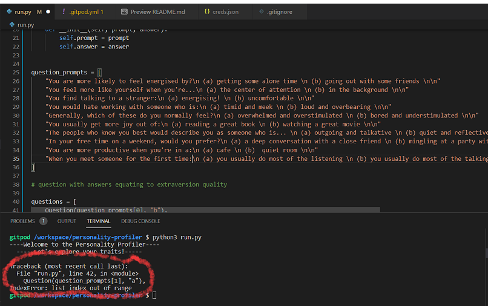

# Personality Profiler

The Personality Profiler is a terminal based personality survey using Python 3, which will capture and analyse data of the personality traits of extroversion and introversion.
 

## UX

### User Stories

    i. As a user I want to easily understand the terminal commands
    ii. As a user I want to answer questions that are concise and engaging
    iii. As a user I want feedback on my inputs and for any errors to be handled without much disruption
    iv. As a user I want to receive analysis on my survey answers
 

## APPLICATION FEATURES

 

### BUGS AND ERRORS

 

 
When creating the run_survey function I encountered an error "Index Error: List index out of range" On closer expection I realised I had failed to seperate each question item with a comma, so the indexing was invalid. Once I added commas, the function ran as expected and generated feedback for the user.
 

## CREDITS

### CONTENT
 
https://ideas.ted.com/quiz-are-you-an-extrovert-introvert-or-ambivert/r
 
Canva for project logo creation

 

### CODE

#### TUTORIALS
 

[Mike Dane]("https://www.youtube.com/watch?v=SgQhwtIoQ7o") 

