 

 

## PERSONALITY PROFILER

The Personality Profiler is a terminal based personality survey using Python 3, which will capture and analyse data of the personality traits of extroversion , introversion and ambiversion. Users are given a score out of 10 for extroversion which will calculate their trait. They are asked further questions relating to how they feel about the pandemic and this data can be used to analyse trends in personality types and the effect of the Covid Pandemic.
 
 

[Here is the live version of my project]("https://personality-profilerkr.herokuapp.com/")

### USER STORIIES

 
i. As a user I want to easily understand the terminal commands
ii. As a user I want to answer questions that are concise and engaging
iii. As a user I want feedback on my inputs and for any errors to be handled without much disruption
iv. As a user I want to receive analysis of my survey answers

 

### FLOW CHART PLAN

 
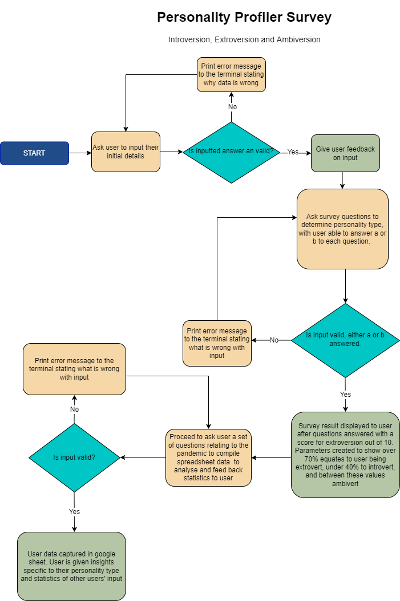
 

### APPLICATION FEATURES

#### Welcome and Intial Input

The user is welcomed to the Personality Profiler in the terminal, and is then asked to enter personal details: name, age, gender and location.  Any input errors are handled and they receive feedback on their input.
 
 
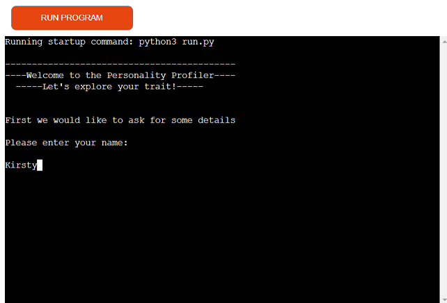
 

#### Question Class

I created a Question Class. There are two instances of the class for the intial personality trait survey, and for the set of questions about the effect of the pandemic
 

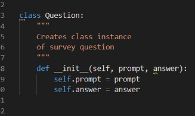
 

#### Personality Survey Questionnaire

Next a series of 10 questions are asked to find out if the user is an extrovert, introvert or ambivert. To make this function I opted to score the result out of 10 for extroversion, so any user answers which corrrelated to the answer that equates to extroversion would be added to the final results. From here the personality type is calculated, with scores equal to or greater than 7/10 giving an extrovert result, answers less than or equal to 4/10 giving an introvert result and any other score giving an ambivert result.
 
The user is then given a display of their score and the correlating personality type.
 
 
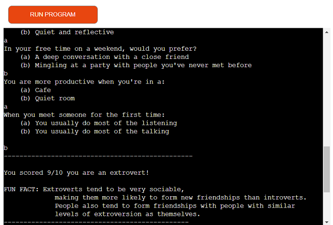
 

#### Pandemic Questions

The next section is a series of 5 questions about how the user has found the pandemic, lockdowns etc. The intention to compile data that can be analysed and shared with the user. for example, "Question 2. Did you notice any change in how you relate to other people. e.g. if you are introverted did you become more extroverted i.e. doing more zoom calls, if you are extroverted did you become more introverted i.e. you became less outward and focused on your interal world a little more.
 
The data compiled may show a change in how people relate, possibly those who are extroverted becoming more comfortable with being less out going for example. Of course this data compiling is quite simplistic and could be more sophisticated. 
 
 
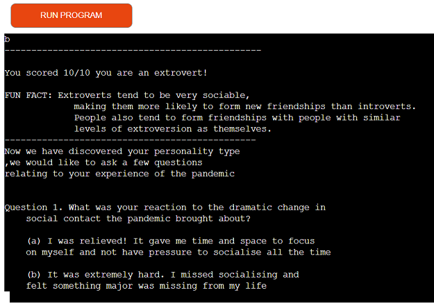
 

#### Data sent to Google Sheets

After the user has answered the survey, and pandemic questions their input is captured and linked to an external Google Sheet:
 
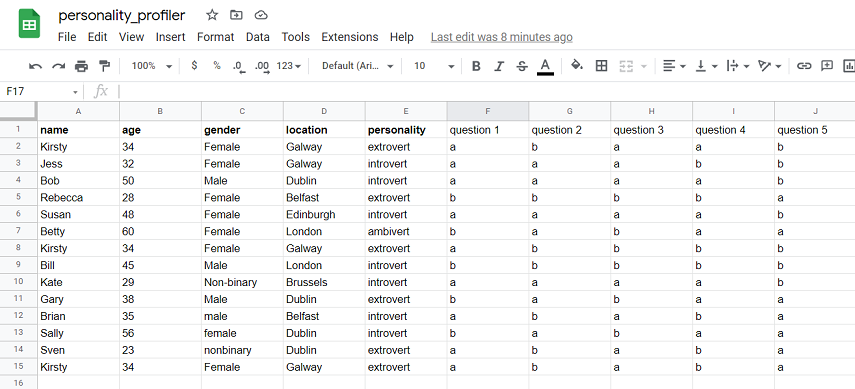
 
The spreadsheet has been populated with some dummy data.

 
 

#### Final message to User

The user is thanked for their input which signals the end of the program
 
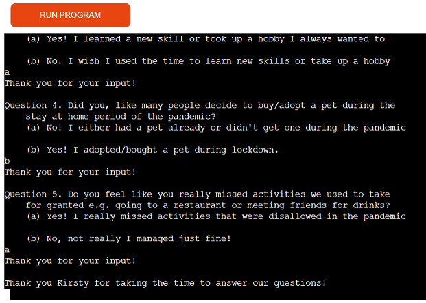>
 
### FUTURE FEATURES

 
I would like to implement more analysis in the project, by capturing more data in the spreadsheet and creating different functions to find trends in responses. E.g. Did extroverts start to become more comfortable with lockdown and less social contact.
 
Features to implement:
 
 - A more sophisticated survey that would give more detailed data to analyse and feedback to the user
 
 - Compilation of graphs to show user correlations between personality traits and impact of the pandemic
 
 - Links to external resources on each personality type
 

### TESTING

- I have manually tested the project in gitpod terminal and Code Institute's Heroku terminal
 
-I have inputted invalid data to test the error handling for better user experience
 
- I have tested and validated the project through a PEP8 linter
 

### DEPLOYMENT

The project was deployed using Code Institute's Heroku terminal.
 
Steps to deployment in Heroku:
 
- 1. Sign into Heroku account and select create new app.
- 2. Choose app name and select Europe region, click create app
- 3. Click Settings tab and select reveal Config Vars
- 4. Create a Config Vars, enter CREDS for key value and copy entire cres.json file
    from gitpod into the value key then click add.
- 5. Add another Config Var with key PORT and value 8000
- 6. Next click add buildpack and click python and then save changes
- 7. Click add buildpack again, select nodejs and save
- 8. Scroll up and click on deploy section from top menu
- 9. Select Github as deployment method and type in repository name of project
- 10. Click search and hit connect on repository name
- 11. As I want Heroku to allow updates to my project I will select enable automatic deploys next
- 12. Hit deploy branch, and you will see "your app has been deployed", click on link to
go to the deployed project

#### BUGS AND ERRORS

 
When creating the run_survey function I encountered an error "Index Error: List index out of range" On closer expection I realised I had failed to seperate each question item with a comma, so the indexing was invalid. Once I added commas, the function ran as expected and generated feedback for the user:

 

 
After I made the function to run the personality survey questions, I created a function called "calculate_trait()" that would take the "score" of the questions and give a value out of 10. By default I have the answers set to equate to an extrovert tendancy. Anything above 70% returns that the user is an extrovert, anything below 40% returns that the user is an introvert, and in between returns that the user is an ambivert. In the run_survey function I have a concatenated string giving the result value / the length of questions which equates to 10. I tried the code to state'" if result > 7/10, print message to user that they are an extrovert. And if "result < 4/10, print message to user that they are an introvert, else print they are an ambivert. Because the values are string values thus didn't work, so instead I changed the conditions and just took the result > 7, or < 4, as the result variable is a number this works, and because the length or questions is 10 it is easy to translate that as a percentage.
 
 
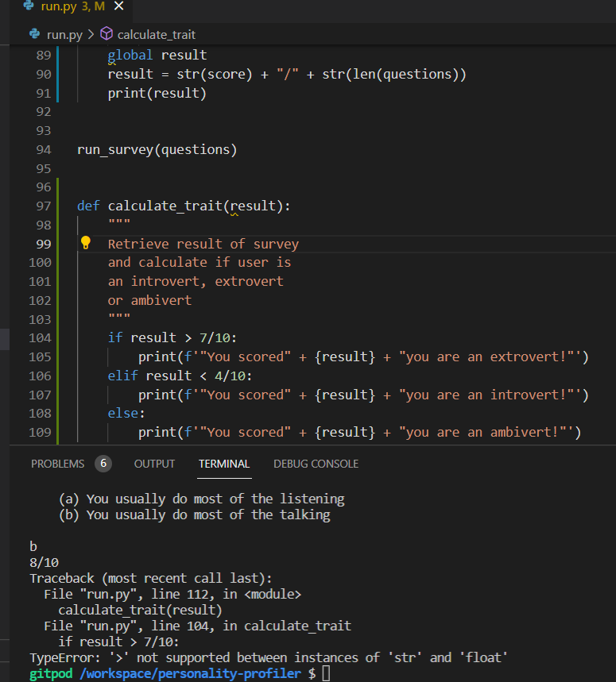
 
 
In my first function capture_user() I have 4 different inputs, 3 are text inputs:
Name, Gender and Location. The 4th is a numeric input, Age. I used the int(input()) method to insert age but the terminal showed an error when I tried to validate the input:
 
 
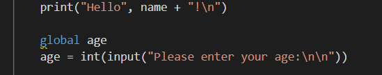
 
 
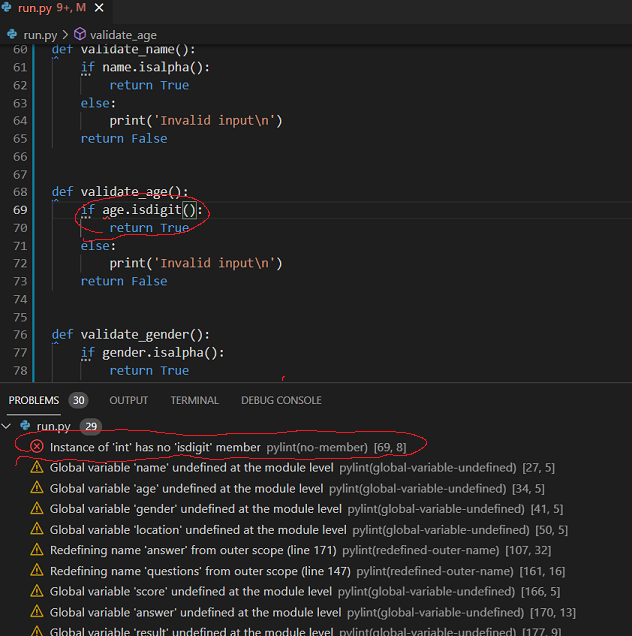

 
I changed the input to age = input("Please input your age:"), and this worked!
 
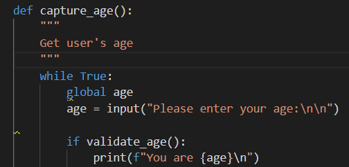
 
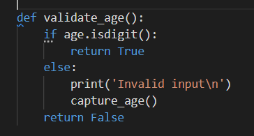
 
 

### CREDITS

#### Content

- The questions and info for the survey were taken from this TED.com article:
 

- [TED]('https://ideas.ted.com/quiz-are-you-an-extrovert-introvert-or-ambivert/')
 
 
- The list of questions relating to the pandemic were written by myself.
 
 
- More info on extroversion:
 

- [Very Well Mind]('https://www.verywellmind.com/what-is-extroversion-2795994')
 

#### Code

[Code Institute "Love Sandwiches" Project:](https://github.com/Code-Institute-Solutions/love-sandwiches-p5-sourcecode)

 
I used the Love Sandwiches walkthrough project steps to link to Google Sheets.
 

#### Tutorials

[Mike Dane]("https://www.youtube.com/watch?v=SgQhwtIoQ7o") 
 
This tutorial helped me to create a Question Class instance and build the main survey questions to find out the users' personality type.
 
 
This site gave useful info on validating user input type:
 

[Better Programming]("https://betterprogramming.pub/how-you-make-sure-input-is-the-type-you-want-it-to-be-in-python-521f3565a66d")
 

My mentor Gerard McBride for project scope advice and suggestions

